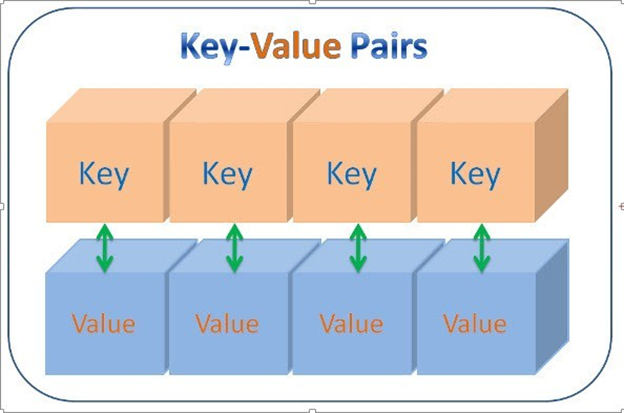

# EMBEDDED_INTERVIEW_T7

<details>
  <summary><h1>▶ C programming language</h1></summary>
## 1. C Basic 

**1.1 Typedef**

**1.2 Struct**

**1.3 For**

**1.4 While**

**1.5 Do**

**1.6 If Else**

**1.7 Switch case**


## 2. Pointer

**2.1 Con trỏ**
- Là một biến mà nó lưu địa chỉ của biến khác

E.g : 


- Biến number có giá trị là 50, địa chỉ là fff4
- Trong đó p là biến con trỏ trỏ đến địa chỉ fff4 của biến number

E.g : 
```c
#include <stdio.h>

int a = 10;

void test(){
    printf("this is test\n");
}
int main(int argc, char const *argv[])
{
    int *ptr = &a;
    printf("dia chi %p\n", &test); 
    printf("dia chi a %p\n", &a );

    printf("gia tri ptr %p\n", ptr);

    printf("gia tri cua bien ma con tro dang quan li %d ", *ptr);
    return 0;
}
```


**Kích thước con trỏ**
Con trỏ chỉ lưu địa chỉ nên kích thước của mọi con trỏ là **như nhau**. Kích thước này phụ thuộc vào môi trường hệ thống máy tính:
- Môi trường Windows 32 bit: 4 bytes
- Môi trường Windows 64 bit: 8 bytes
```c
int main(int argc, char const *argv[])
{

void *ptr= &tong;
printf("size: %d\n", sizeof(ptr));
// Kích thước biến con trỏ phụ thuộc vào kiến trúc của vi xử lí
//64 /8bit = 8 byte
//32/8 = 4

return 0;
}
```


**2.2 Con trỏ Void (Void Pointer)**

- Con trỏ void là con trỏ đặc biệt, có thể trỏ đến mọi địa chỉ
- Dùng con trỏ void thì phải ép kiểu
```c
int main(int argc, char const *argv[])
{
    int i = 10;
    double d = 10.3;
    char c = 'A';
    //int *ptr = &d; : máy sẽ báo lỗi vì không cùng kiểu dữ liệu  
    void *ptr; // là con trỏ đặc biệt, nó sẽ trỏ đến địa chỉ của mọi đối tượng không cần biết đó là kiểu dữ liệu gì 
    ptr = &i; 
    // printf(" gia tri cua ptr %p\n", *ptr); : in ra lỗi vì nó chỉ biết địa chỉ của i chứ không biết nó mang kiểu dữ liệu gì nên ta phải ÉP KIỂU
    printf("test i = %d\n", *(int*)ptr ); // (int*)ptr: giá trị của địa chỉ này là kiểu integer   
    ptr = &d;
    printf("test d = %f\n", *(double*)ptr);
    ptr = &c;
    printf("test c = %c\n", *(char*)ptr);
 return 0;
}

```
**2.3 Function Pointer**
- Trỏ đến địa chỉ của hàm
- Dùng để gọi hàm thông qua con trỏ
`kiểu trả về hàm(*tên con trỏ hàm)(kiểu input, kiểu input )`
Ex:
```c
// con trỏ hàm sẽ trỏ đến địa chỉ của hàm
void tong(int a, int b){
    printf("tong %d va %d = %d\n", a, b, a+b);
}

void hieu(int a, int b){
    printf("hieu %d va %d = %d\n", a, b, a-b);
}

int tich(int a, int b){
    return a*b;
}
int main(int argc, char const *argv[])
{
    void(*ptr)(int,int); 
    ptr = &tong;
    ptr(8,7);
    ptr = &hieu;
    ptr(10,6);
    
    int (*ptrtich)(int,int) = &tich; // Con trỏ ptr trỏ tới hàm tích
    printf("tich %d\n", ptrtich(6,5));
    return 0;
}

```
**2.3.1 Con trỏ hàm làm input parameter**

```c
// con trỏ hàm sẽ trỏ đến địa chỉ của hàm
//input là 1 hàm dùng 1 con trỏ hàm
// cú pháp: void tenham(void(*tencontro)(kieu dau vao, kieu dau vao), tham so dau vao, tham so dau vao)
void tinhtoan(void(*func)(int, int), int a, int b ){
    printf("Tinh toan\n");
    func(a,b);
}
int main(int argc, char const *argv[])
{
  tinhtoan(&tong, 4, 9);   
  tinhtoan(&hieu, 8, 2);
  tinhtoan(&tich, 2, 6);
    return 0;
}

```
**2.3.2 Dùng con trỏ void trỏ đến địa chỉ của con trỏ hàm để hiển thị**
```c
void *ptr = &tong;
((void(*)(int,int))ptr)(7,5);

```


**2.4 Con trỏ NULL**
- Là con trỏ có địa chỉ và giá trị bằng 0
- Vì khai báo con trỏ bất kì thò phải có giá trị nếu không thì con trỏ sẽ trỏ tới giá trị rác
Ex:
```
```


**2.5 Pointer to Pointer**
- **Pointer to pointer** là một loại con trỏ dùng để lưu trữ địa chỉ của biến con trỏ.

VD: 
- ina = 10// 0xc1       
//giá trị 10, địa chỉ 0xc1
 int*ptr = &a // 0xc1; 0xa5
 //giá trị 0xc1, địa chỉ 0xa5``


- int**ptr ( giá trị của biến trỏ ) = &ptr= 0xa5
 *(0xa5)= 0xc1 --> **(0xa5)= 10


## 3. Memory Allocation


| Stack |
|:-----:|
|   ↓   |
|   ↑   |	
|  Heap |
|  Bss(Uninitialized data)  |
|  Data(Initialized data)   |
|  Text |

- ***Text:*** Quyền truy cập chỉ có thể Read
	- Chứa khai báo các hằng số(.rodata)
	- Nó chưa lệnh thực thi nên tránh sửa đổi instruction
- ***Data:*** Quyền truy cập Read-Write
	- Chứa biến toàn cục hoặc biến static: Có giá trị khởi tạo khác 0
	- Được giải phóng khi kết thúc chương trình
- ***Bss:*** Quyền truy cập Read-Write
	- Chứa biến toàn cục hoặc các biến static: Có giá trị khởi tạo bằng 0 hoặc không khởi tạo
	- Được giải phóng khi kết thúc chương trình
- ***Stack:*** Quyền truy cập là Read-Write.
	- Được sử dụng cấp phát cho biến local, input parameter của hàm,...
	- Sẽ được giải phóng khi ra khỏi block code/hàm
- ***Heap:*** Quyền truy cập là Read-Write.
	- Được sử dụng để cấp phát bộ nhớ động như: Malloc, Calloc,...
	- Sẽ được giải phóng khi gọi hàm free,...


**Cấp phát động**
- khai báo 1 mảng mà chưa rõ phải sử dụng kích thước là bao nhiêu --> cấp phát động
- Cấp phát động bộ nhớ chính là việc cấp phát/giải phóng, thay đổi kích thước bộ nhớ một cách linh hoạt. Giúp chúng ta điều khiển được việc sử dụng bộ nhớ của chương trình.

- **Malloc:**  
Ex: tạo 5 ô nhớ cho kiểu uint16
```c
 C1:   uint16_t *ptr = (uint16_t *)malloc(2*5)
 C2:   uint16_t *ptr2 = (uint16_t *)malloc(sizeof(uint16_t)*5);
```
- **Realloc:**
Ex: thay đổi size lên 7 ô nhớ
```c
    ptr2 = (uint16_t *)realloc(ptr2, sizeof(uint16_t)*7);
```
- **Free:** 
Ex:
```c
 free(ptr); // Thu hồi vùng nhớ
```

## 4. Variables 
**4.1 Biến Static**
- Biến static cục bộ: Khi 1 biến cục bộ được khai báo với từ khóa static. Biến sẽ chỉ được khởi tạo 1 lần duy nhất và tồn tại suốt thời gian chạy chương trình. Giá trị của nó không bị mất đi ngay cả khi kết thúc hàm. Tuy nhiên khác với biến toàn cục có thể gọi trong tất cả mọi nơi trong chương trình, thì biến cục bộ static chỉ có thể được gọi trong nội bộ hàm khởi tạo ra nó. Mỗi lần hàm được gọi, giá trị của biến chính bằng giá trị tại lần gần nhất hàm được gọi.


_E.g :  Khi chưa khai báo biến static_
```c
void test(){
    static int a =10;  // giả sử có địa chỉ là 0xc1
    printf("a = %d\n", a);
    a++;
}

int main(int argc, char const *argv[])
{
    test(); // nó sẽ được lưu ở phân vùng nhớ đó 
    test(); // khi chạy lần 2 thì sẽ không khởi tạo lại mà tiếp tục thực hiện tức là a + 1 
    test(); // tương tự

    return 0;
}
```
Kết quả: 
10
10
10


_E.g :  Khi dùng biến static_
```c
void test(){
    static int a =10;  // giả sử có địa chỉ là 0xc1
    printf("a = %d\n", a);
    a++;
}

int main(int argc, char const *argv[])
{
    test(); // nó sẽ được lưu ở phân vùng nhớ đó 
    test(); // khi chạy lần 2 thì sẽ không khởi tạo lại mà tiếp tục thực hiện tức là a + 1 
    test(); // tương tự

    return 0;
} 
```
Kết quả: 
 10
 11
 12


- Biến static toàn cục: Biến toàn cục static sẽ chỉ có thể được truy cập và sử dụng trong File khai báo nó, các File khác không có cách nào truy cập được. 


**4.2 Biến Extern** 
- Gọi hàm, biến từ một file khác
- Biến Static toàn cục không lấy được qua extern

VD: Muốn gọi biến a ở file test. sang file main.c, ta thực hiện ở file main.c như sau:

extern a;

Tại Terminal gõ: `gcc main.c test.c` --> `enter`
Gõ `./main` 


**4.3 Biến Volatile**
```c
volatile int test; // thông báo cho compiler không được phép tối ưu test
    while (1)
    {
        test = readdataUART(); // khi chạy sẽ bỏ qua bước này
        A();
        B();
        C();
    }  
    return 0;
```


**4.4 Biến Register**
- Tác dụng của từ khóa register, nói một cách ngắn gọn là làm tăng hiệu năng(performance) của chương trình.


- Có register thì xử lí nhanh hơn.
- Hiện nay người ta không còn sủ dụng register nữa vì tốc độ xử lí của RAM đã nhanh hơn tuy nhiên một vài controller còn sử dụng.

Ex:
```c

int main(int argc, char const *argv[])
{
    clock_t start, end;
    double test;
    register  i; 
    start = clock();
    for (; i < 0xFFFFFFFF; i++);
    end = clock();
    test = ((double)(end - start))/CLOCKS_PER_SEC;
    printf("time: %f\n", test);
    return 0;
}

// không có register: time: 7.550000
// có register        time: 0.951000

``` 

## 5. Struct and Union
Struct và Union là 2 cấu trúc dữ liệu do lập trình viên định nghĩa bao gồm các biến với kiểu dữ liệu khác nhau.

**5.1 Struct**

Cú Pháp:
```c
struct <tên kiểu cấu trúc>
{
<kiểu dữ liệu> <tên thành phần 1>;
… 
<kiểu dữ liệu> <tên thành phần n>;
} <tên biến 1>, <tên biến 2>;

```
Ex: 
```c
struct dulieuhocsinh {
    int tuoi;
    float chieucao;
    int namsinh;
}hocsinh1;
```

**5.2 Union**
- Được khai báo và sử dụng như cấu trúc
- Các thành phần của union có chung địa chỉ đầu (nằm chồng lên nhau trong bộ nhớ)

Cú Pháp
```c
union <tên kiểu cấu trúc>
{
<kiểu dữ liệu> <tên thành phần 1>;
… 
<kiểu dữ liệu> <tên thành phần n>;
} <tên biến 1>, <tên biến 2>;
 ```
Ex:

```c
typedef union{
        uint8_t var1[2];
        uint8_t var2[3];
        uint8_t var3[1];   
}typeunion;
```

**5.3 So sánh Struct và union**

Về mặt ý nghĩa, struct và union cơ bản giống nhau(đều là kiểu dữ liệu do người dùng tự định nghĩa). Tuy nhiên, về mặt lưu trữ trong bộ nhớ, chúng có sự khác biệt rõ rệt như sau:

•	**Struct**: Dữ liệu của các thành viên của struct được lưu trữ ở những vùng nhớ khác nhau. Do đó kích thước của 1 struct tối thiểu bằng kích thước các thành viên cộng lại tại vì còn phụ thuộc vào bộ nhớ đệm (struct padding)

•	**Union** : Dữ liệu các thành viên sẽ dùng chung 1 vùng nhớ. Kích thước của union được tính là kích thước lớn nhất của kiểu dữ liệu trong union. Việc thay đổi nội dung của 1 thành viên sẽ dẫn đến thay đổi nội dung của các thành viên khác.


**5.4 Ví dụ về truyền data sử dụng union và struct**
```c
typedef union{
    struct{
        uint8_t id[2];
        uint8_t data[3];
        uint8_t checkSum[1];


    }object;
    uint8_t array[6];
   
}dataFrame;


int main(int argc, char const *argv[])
{
    //Gói data cần phải truyền: 1 byte ID
    //                          3 byte DATA
    //                          1 byte CS
    //                          0x01 0xC2 0xF8
    dataFrame test;
    test.object.id[0] = 0x01;
    test.object.id[1] = 0x02;

    test.object.data[0] = 0xC8;
    test.object.data[1] = 0xF8;
    test.object.data[2] = 0xF2;

    test.object.checkSum[0] = 0xA7;
    return 0;
}
```


## 6. Compiler 
Chương trình được viết bằng C muốn chạy được trên máy tính phải trải qua một quá trình biên dịch để chuyển đổi từ dạng mã nguồn sang chương trình dạng mã thực thi. Quá trình được chia ra làm 4 giai đoạn chính:


•	Giai đoàn tiền xử lý (Pre-processor)

•	Giai đoạn dịch NNBC sang Asembly (Compiler)

•	Giai đoạn dịch asembly sang ngôn ngữ máy (Assembler)

•	Giai đoạn liên kết (Linker)


**6.1 Pre-processor (Giai đoạn tiền xử lý):** 

Nhận mã nguồn và xóa bỏ các dòng comments, xử lý các chỉ thị tiền xử lý có bắt đầu bằng kí hiệu `#`. Như `#include` (thay thế mã chương trình của một tệp tiêu để vào mã nguồn cần dịch), `#define` (thay thế bằng giá trị cụ thể tại mỗi nơi sử dụng trong chương trình).
	-  Sau khi qua quá trình tiền xử lý thì file code lúc này sẽ có dạng `.i`.
	-  Dùng lệnh `gcc -E filename.c -o filename.i` hoặc `gcc -E filename.c` để xem code sau khi qua quá trình preprocessor.


**6.2 Compiler (Giai đoạn dịch NNBC sang ngôn ngữ Assembly)**

Kiểm tra các kiểu dữ liệu có lỗi hay không, phân tích cú pháp (syntax) của mã nguồn NNBC và tối ưu code.
	-  Quá trình này sẽ biên dịch từ code `.i` sang ngôn ngữ assembly `.s`.
	-  Dùng lệnh `gcc -S -o filename.s filename.c` để có thể xem code sau quá tình compiler.
 
**6.3 Assembler (Giai đoạn dịch ngôn ngữ Assembly sang ngôn ngữ máy):**

- Biên dịch ngôn ngữ Assembly sang ngôn ngữ máy (0 và 1). Và tạo ra tệp tin Object `.o` or `.obj`.
-  Dùng lệnh `gcc -c filename.c -o filename.o` để tạo ra file ".o" và dùng lệnh `objdump -d -Mintel filename.o` để xem code.

**6.4 Linker (Giải đoạn liên kết):** 
- Trong giai đoạn này mã máy của một chương trình `.o` dịch từ nhiều nguồn (file .c hoặc file thư viện .lib) được liên kết lại với nhau để tạo thành chương trình đích nhất. Mã máy của các hàm thư viện gọi trong chương trình cũng được đưa vào chương trình cuối trong giai đoạn này. Chính vì vậy mà các lỗi liên quan đến việc gọi hàm hay sử dụng biến tổng thể mà không tồn tại sẽ bị phát hiện. Kể cả lỗi viết chương trình chính không có hàm main() cũng được phát hiện trong liên kết.

- File sau khi được gộp lại thì sẽ có đuôi mở rộng Executable `.exe`, còn trên Linux và MacOs thì có thể có đuối theo chỉ định hoặc không có đuôi mở rộng.

- Để chạy file code C trên `terminal` dùng lệnh `gcc -o filename filename.c` đẻ tạo ra tệp thực thi, sau đó dùng lệnh `./filename` để chạy tệp thực thi đó.


## 7. Macro and Function
**7.1 Macro**
 Macro không phải là kiểu dữ liệu mà là một định nghĩa 1 đoạn chương trình nào đó bằng một tên, khi gọi tên chương trình đó thì quá trình tiền xử lí sẽ copy chương trình đó bỏ vào.

**7.1.1 #ifndef** (if not define)
Ex:

`

`#ifndef STM32
#define STM32
*chương trình*


`

**7.1.2 Tạo chuỗi**
- Mỗi con chip có những thanh ghi khác nhau, ta định nghĩa cho mỗi con chip vì thế chương trình phía dưới chỉ cần thay đổi
- Để tạo chuỗi ta dùng #


**7.1.3 __VA_ARGS__**

**7.2 Function**
- Function là một khối lệnh thực hiện chức năng nào đó.
- Program counter: là bộ đếm
- Stack pointer: lưu bộ nhớ, 
- Vào 0x0000 sẽ khởi tạo Program count và Stack pointer
- Program count sẽ đếm từng địa chỉ và đọc giá trị của từng địa chỉ ra. Thì giá trị đó sẽ làm cho chương trình chạy.

lưu thằng tiếp theo vào stack pointer 

**7.3 So sánh Macro và Function**


 | |Macro  | Function |
 |-|-------|----------|
 | **Được xử lí ở**| Preprocessor | Compiler|
|**Tóm tắt quá trình thực hiện** | Thay thế đoạn code macro vào chỗ được gọi trước khi được biên dịch | 	Khi thấy hàm được gọi, compiler sẽ phải lưu con trỏ chương trình PC (Program Counter) hiện tại vào stack(stack counter); chuyển PC tới hàm được gọi, thực hiện hàm đó xong và lấy kết quả trả về; sau đó quay lại vị trí ban đầu trong stack trước khi gọi hàm và tiếp tục thực hiện chương trình. |
| **Kích thước**|  lớn file main.i sẽ dài hơn| file sẽ nhiều hơn assembly nhỏ | 
|**Tốc độ** |nhanh  | chậm |

file main.i

tốn ram hơn

## 8.REVIEW C - Interview Question 
1. Khác nhau giữa Macro và Function? Kích thước lớn là cái gì lớn? RAM_file.i_file.s_file.o_file.exe


2. Có bao nhiêu phân vùng nhớ? Liệt kê và nêu rõ?

3. Khác nhau giữa Stack và Heap?

4. Không giải phóng vùng nhớ bằng Free thì chương trình sẽ như thế nào? Nếu shut down máy thì sẽ hết tình trạng đó không?
- Có vì phần vùng nhớ nằm trong RAM, mà RAM thì sẽ bị reset khi tắt nguồn.

5. Biến Static toàn cục và Static cục bộ?

6. typedef struct{
	int x;
	int y;
}Points; 
Points nằm ở phân vùng nào? 

- Không ở phân vùng nào cả (nếu không sử dụng Points)
Nằm ở phân vùng text (Nếu có sử dụng Points)
	Vì nếu k sử dụng Points thì quá trình Compiler sẽ bỏ đi khai báo của Points
	Nếu có sử dụng Points thì quá trình Compiler sẽ để lại khai báo của Points
7. Struct và Union?

8. Con trỏ là gì?
9. Liệt kê các loại con trỏ và nêu rõ từng loại?

11. Quá trình compiler diễn ra như nào?
	

## Additional Knowledge
</details>

<details>
  <summary><h1>▶ C++ programming language</h1></summary>

## 1.CLASS
1.1 What is class?
- Class là một cấu trúc dữ liệu tự định nghĩa, nó cho phép lập trình viên tạo ra các đối tượng (**objects**) mới có cùng bản chất.

- Class định nghĩa các thuộc tính data members còn gọi là **property** và phương thức member functions còn gọi là **method** mà các đối tượng của nó có thể sử dụng.
- Trong C++, từ khóa class sẽ chỉ điểm bắt đầu của một class sẽ được cài đặt. Class trong C++ giúp tổ chức mã nguồn một cách có cấu trúc và tái sử dụng, đồng thời cho phép ẩn thông tin và triển khai tính kế thừa, đa hình và đóng gói.

**Phạm vi truy cập (Access modifiers):**
Access modifier là phạm vi truy cập của các thuộc tính và phương thức sẽ được khai báo bên dưới nó. Có 3 phạm vi truy cập trong C++ là public, private và protected.

- **Public**: Các member được khai báo trong Public thì các Object có thể truy cập trực tiếp tới được. Và các User có thể sử dụng và thay đổi các giá trị trong các member này
- **Private**: Được sử dụng khi bạn muốn chặn User truy cập vào những member khai báo trong phạm vi này, giới hạn truy cập và sửa đổi giá trị của chúng. Sử dụng các member trong Public để truy cập đến các member trong Private.
- **Protected**: Tương tự như Private, nhưng Private thì các class con không thể kết thừa được các member trong Private của class chính, còn Protected thì lại cho phép các class con có thể kế thừa được các member trong protected của class chính.
**1.2 Constructor**
- Constructor hay hàm dựng là một hàm đặc biệt.
- Constructor là một hàm sẽ có tên trùng với tên của class.
- Sẽ được gọi chạy đầu tiên ngay khi chúng ta khởi tạo một object.

**1.3 Destructor**

## 2.OOP
Có 4 đặc tính: Tính kế thừa, đa hình, trừa tượng và đóng gói

**2.1 Inheritance (Tính kế thừa )**
Trong lập trình hướng đối tượng có ý nghĩa, một class có thể kế thừa các thuộc tính của một class khác đã tồn tại trước đó. Khi một class con được tạo ra bởi việc kế thừa thuộc tính của class cha thì chúng ta sẽ gọi class con đó là subclass trong C++, và class cha chính là superclass trong C++

**2.2 Abstraction (Tính trừu tượng)**
Tính trừu tượng trong lập trình hướng đối tượng là một khả năng mà chương trình có thể bỏ qua sự phức tạp bằng cách tập trung vào cốt lõi của thông tin cần xử lý. Điều đó có nghĩa, bạn có thể xử lý một đối tượng bằng cách gọi tên một phương thức và thu về kết quả xử lý, mà không cần biết làm cách nào đối tượng đó được các thao tác trong class. Ví dụ đơn giản, bạn có thể nấu cơm bằng nồi cơm điện bằng cách rất đơn giản là ấn công tắc nấu, mà không cần biết là bên trong cái nồi cơm điện đó đã làm thế nào mà gạo có thể nấu thành cơm.

**2.3 Polymorphism (Tính đa hình)**
Tính đa hình trong lập trình hướng đối tượng là một khả năng mà một phương thức trong class có thể đưa ra các kết quả hoàn toàn khác nhau, tùy thuộc vào dữ liệu được xử lý. Ví dụ đơn giản, cùng là một class quản lý dữ liệu là các con vật, thì hành động sủa hay kêu của chúng được định nghĩa trong class sẽ cho ra kết quả khác nhau, ví dụ nếu là con mèo thì kêu meo meo, còn con chó thì sủa gâu gâu chẳng hạn. 

**2.4 Encapsulation (Tính đóng gói)**
Tính đóng gói trong lập trình hướng đối tượng có ý nghĩa không cho phép người sử dụng các đối tượng thay đổi trạng thái nội tại của một đối tượng, mà chỉ có phương thức nội tại của đối tượng có thể thay đổi chính nó. Điều đó có nghĩa, dữ liệu và thông tin sẽ được đóng gói lại, giúp các tác động bên ngoài một đối tượng không thể làm thay đổi đối tượng đó, nên sẽ đảm bảo tính toàn vẹn của đối tượng, cũng như giúp dấu đi các dữ liệu thông tin cần được che giấu. Ví dụ đơn giản, khi bạn dùng một cái iphone, bạn không thể thay đổi các cấu trúc bên trong của hệ điều hành iOS, mà chỉ có Apple mới có thể làm được điều này thôi.

**SUMMMARY**
- Tính đa hình: là cùng một phương thức với các input khác nhau thì sẽ cho ra các kết quả khác nhau. Trong một Class thì những method có thể trùng tên nhau nhưng phải khác input parameter.

E.g: Cách di chuyển. Khi input là người thì cách di chuyển là hai chân, input là mèo thì cách di chuyển là bốn chân, input là cá thì cách di chuyển là đuôi. Hoặc ví dụ về loại nhạc cụ.

- Tính trừu tượng: là một khả năng mà chương trình có thể bỏ qua sự phức tạp bằng cách tập trung vào cốt lõi của thông tin cần xử lý.
E.g: Như máy giặc ta chỉ cần bỏ đồ vào và bấm nút còn bên trong máy giặc, giặc như thế nào ta không cần quan tâm.

- Tính đóng gói: Các thuộc tính phải được nằm trong private để gán giá trị cho nó hoặc lấy giá trị của nó ra thì phải thông qua. Ý nghĩa là tránh cho người dùng cang thiệp vào và sửa đổi dữ liệu.


### 3.Vector
- Vector là một cấu trúc dữ liệu trong C++ dùng để chứa các đối tượng khác. Tương tự như mảng (array), vector cũng có thể chứa nhiều phần tử.
- Tuy nhiên, nếu như số lượng phần tử (size) của một mảng là cố định, thì ở vector, nó hoàn toàn có thể thay đổi trong suốt quá trình làm việc của chương trình
- vector khác mảng thông thường là kích thước của vector có thể thay đổi trong quá trình thực thi chương trình. Khi cần, vector có thể mở rộng (tăng kích thước) hoặc thu hẹp (giảm kích thước) để chứa thêm hoặc loại bỏ các phần tử.
- Trước khi sử dụng thư viện `#include<vector>`.

- So sánh với mảng tĩnh, vector tiêu thụ bộ nhớ hơn để đổi lấy khả năng quản lý lưu trữ và tăng kích thước động một cách hiệu quả.
**Modifier**

- ***push_back():*** Hàm đẩy một phần tử vào vị trí sau cùng của vector. Nếu kiểu của đối tượng được truyền dưới dạng tham số trong push_back() không giống với kiểu của vector thì sẽ bị ném ra. VD: ten-vector.push_back(ten-cua-phan-tu);
	- ***assign():*** Nó gán một giá trị mới cho các phần tử vector bằng cách thay thế các giá trị cũ. VD: ten-vector.assign(int size, int value);
	- ***pop_back():*** Hàm pop_back () được sử dụng để xóa đi phần tử cuối cùng một vector.
	- ***insert():*** Hàm này chèn các phần tử mới vào trước phần tử trước vị trí được trỏ bởi vòng lặp. Chúng ta cũng có thể chuyển một số đối số thứ ba, đếm số lần phần tử được chèn vào trước vị trí được trỏ.
   	- ***erase():*** Hàm được sử dụng để xóa các phần tử tùy theo vị trí vùng chứa
	- ***emplace():*** Nó mở rộng vùng chứa bằng cách chèn phần tử mới vào
	- ***emplace_back():*** Nó được sử dụng để chèn một phần tử mới vào vùng chứa vector, phần tử mới sẽ được thêm vào cuối vector
	- ***swap():*** Hàm được sử dụng để hoán đổi nội dung của một vector này với một vector khác cùng kiểu. Kích thước có thể khác nhau.
	- ***clear():*** Hàm được sử dụng để loại bỏ tất cả các phần tử của vùng chứa vector.

```c
	//dùng thư viện vector giống cấp phát bộ nhớ động trong c, nhưng có thư viện hỗ trợ các công cụ nhanh hơn.
	#include <vector>
	
	vector<int> array;	// khai báo mảng kiểu int
	array.push_back(4);  //thêm phần tử tại 0 là 4
	array.push_back(8);  //thêm phần tử tại 1 là 8
	array.push_back(20);
	array.push_back(15); //thêm phần tử tại 4 là 15
	
	//từ C++ 11 trở đi có for cải :
	for(int item : array){ // có thể dùng biến auto item, biến auto sẽ tự định nghĩa item thuộc kiểu dữ liệu gì tùy vào giá trị và nó được lưu
		printf("i = %d\n",item);
	}
	
	array.pop_back(); //xóa phần tử cuối cùng, xóa 15
	array.insert(array.begin()+2,77); //chèn phần tử tại 2 là 77, các phần tử phía sau sẽ dời vị trí cho nhau.
	array.erase(array.begin()+2); // xóa phần tử thứ 2, dời những phần tử phía sau lên.
	array.clear(); //thu hồi vùng nhớ giống free
	
	for(int i =0;i<array;i++){
		printf("%d\n",array[i]);
	}
```

### 4. TEMPLATE

- **Template (khuôn mẫu)** là một từ khóa trong C++, và là một kiểu dữ liệu trừu tượng tổng quát hóa cho các kiểu dữ liệu int, float, double, bool...
- **Template** trong C++ có 2 loại đó là function template & class template.
- **Template** giúp người lập trình định nghĩa tổng quát cho hàm và lớp thay vì phải nạp chồng (overloading) cho từng hàm hay phương thức với những kiểu dữ liệu khác nhau.

- **Summary:** Là 1 tính chất của tính đa hình. Những chương trình, hàm có tính đa hình gần giống nhau, người ta sử dụng tính đa hình để biểu diễn. 

E.g
```c
#include <iostream>

template <typename var1, typename var2>

var1 tong(var1 a,var2 b){
    return var1(a+b);
}

int main(){
    printf("tong a va b:%d\n",tong(4,5));
// 4 là int=> var 1 là int , 5 là int => var2 là int
    printf("tong a va b: %f\n",tong(4.3,5));

//4.3 var 1 là double, var 2 là int . ép kiểu cho var 1 theo double

    return 0;
}
```

### 5. NAMESPACE
- **Namespace** là từ khóa trong C++ được sử dụng để định nghĩa một phạm vi nhằm mục đích phân biệt các hàm, lớp, biến, ... cùng tên trong các thư viện khác nhau

```c
#include <iostream>
#include "test.cpp"


using namespace ConOngA;
namespace ConOngA{
    int Teo = 20;

}
// Chỉ được 1 biến Teo. Không được khai báo thêm 1 biến Teo 

namespace ConOngB{
    int Teo = 30;
}

//Để sử dụng 2 biến ConOngA và ConOngB thì ta sử dụng namespace  


using namespace ConOngA; // thì lúc này ở hàm main có thể gọi trực tiếp Teo, không cần phải gọi ConOngA nữa


int main(int argc, char const *argv[])
{
    std::cout<<ConOngA::Teo<< std::endl; 
    std::cout<<ConOngB::Teo<<std::endl;

    // Là biến bình thường chỉ khác địa chỉ vùng nhớ nó lưu

    ConOngA::SinhVien sv;
    sv.TEN = 10;
    std::cout<<Teo<<std::endl;

    // ConOngA ở file test và ở file này là 1 vùng nhớ chung nên những member phía trong sẽ không được trùng nhau
    // Khi ngta thiết kế thư viện có những thứ bên trong trùng nhau vd như độ ẩm ( độ ẩm của đất hoặc không khí), thì người ta sẽ thiết kế các namespace khác nhau
    
    return 0;
}
    

```


### 6. VIRTUAL FUNCTION
- **Hàm ảo (virtual function)** là một hàm thành viên trong lớp cơ sở mà lớp dẫn xuất khi kế thừa cần phải định nghĩa lại.
- **Hàm ảo** được sử dụng trong lớp cơ sở khi cần đảm bảo hàm ảo đó sẽ được định nghĩa lại trong lớp dẫn xuất. Việc này rất cần thiết trong trường hợp con trỏ có kiểu là lớp cơ sở trỏ đến đối tượng của lớp dẫn xuất.
- **Hàm ảo** là một phần không thể thiếu để thể hiện tính đa hình trong kế thừa được hỗ trợ bởi nguồn ngữ C++.
**Lưu ý:** Con trỏ của lớp cơ sở có thể chứa địa chỉ của đối tượng thuộc lớp dẫn xuất, nhưng ngược lại thì không được.
- **Hàm ảo** chỉ khác hàm thành phần thông thường khi được gọi từ một con trỏ. Sử dụng hàm ảo khi muốn con trỏ đang trỏ tới đối tượng của lớp nào thì hàm thành phần của lớp đó sẽ được gọi mà không xem xét đến kiểu của con trỏ.

**Sum:** Khi thiết kế chương trình nếu cho phép class con load lại cái mới nhất thì ta sử dụng virtual function

### 7. LINKED LIST
 **Danh sách liên kết đơn (Single Linked List)** là một cấu trúc dữ liệu động, nó là một danh sách mà mỗi phần tử đều liên kết với phần tử đúng sau nó trong danh sách. Mỗi phần tử (được gọi là một node hay nút) trong danh sách liên kết đơn là một cấu trúc có hai thành phần:

+ Thành phần dữ liệu: lưu thông tin về bản thân phần tử đó.
+ Thành phần liên kết: lưu địa chỉ phần tử đứng sau trong danh sách, nếu phần tử đó là phần tử cuối cùng thì thành phần này bằng NULL.


  


### 8. LIST
 **List** là một danh sách chứa các đối tượng (các nút (node) – lưu trữ các thông tin dữ liệu và địa chỉ của nút kế tiếp, nút trước đó) liên kết với nhau và cho phép chèn thêm hay xóa bất kì một đối tượng nào trong danh sách.
```c
#include <iostream>
#include <list>


using namespace std;

int test[] = {1, 3, 5, 7, 9};

int main(int argc, char const *argv[])
{
    list<int> array =  {1, 2, 3, 4, 5, 6};
    list<int>::iterator it = array.begin();

    advance(it, 2); // Dịch con trỏ tới vị trí 3
    array.insert(it, 10); // chèn 10 vào vị trí 3

    for(int i : array){
        cout<<"i = "<<i <<endl;
    }
    //Hoặc thông qua iterator
    for (list<int>::iterator it = array.begin(); it != array.end(); it++) //it sẽ dịch địa chỉ qua ô    
    {
       cout<<" i = "<<*it<<endl;
    }
    
    //Đối với list thì phải dùng các này. Chứ không thể dùng vòng for như bình thường( i<array.size())
    // Vector giống như malloc, realloc khác với List là kiểu linked list

    array.begin();
    test[1];
    return 0;
}

```

### 9. MAP

- Cấu trúc dữ liệu kiểu map là một cấu trúc dữ liệu ánh xạ giữa cái gọi là khoá (key) sang giá trị của khoá đó (gọi là value)

- Trong cấu trúc dữ liệu này, mỗi một key sẽ nhận một giá trị khác nhau.



```c
#include <iostream>
#include <map>

using namespace std;

typedef struct{
    string ten;
    int tuoi;
}ThongTin;


int main(int argc, char const *argv[])
{
    map<int, ThongTin> SinhVien;

    SinhVien[101] = {"Hoang", 20}; //101: là key, {"Hoang", 20} là value
    SinhVien[102] = {"Tuan", 18};
    SinhVien[103] = {"Quan", 21};
    

    for(auto item : SinhVien){
        cout<<"ID = "<<item.first<<", Ten: "<<item.second.ten<<", Tuoi: "<<item.second.tuoi<<endl;
    }
    return 0;
}


```

**SO SÁNH VECTOR, LIST VÀ MAP**

|            | Vector                   | List                        | Map                            |
|------------|--------------------------|-----------------------------|--------------------------------|
| Ad    | - Truy cập ngẫu nhiên các phần tử thông qua index. <br> - Được triển khai dưới dạng địa chỉ liên tiếp trong bộ nhớ. <br> - Hỗ trợ thay đổi kích thước dễ dàng. | - Chèn và xóa phần tử ở bất kỳ vị trí nào dễ dàng hơn. <br> - Không cần dùng thêm bộ nhớ liền kề để mở rộng kích thước. <br> - Linh hoạt trong việc chèn, xóa và truy xuất. | - Lưu trữ các cặp key-value và tự động sắp xếp theo key. <br> - Truy cập hiệu quả thông qua key. <br> - Hỗ trợ các phương thức cho việc chèn, xóa và truy xuất. |
| Disad | - Chèn và xóa phần tử ở vị trí không phải cuối cùng thì phức tạp hơn. <br> - Cần dùng thêm bộ nhớ liền kề để mở rộng kích thước. <br> - Không hiệu quả cho chèn và xóa phần tử ở đầu hoặc giữa vector. | - Truy cập ngẫu nhiên chậm hơn so với vector. <br> - Chiếm nhiều bộ nhớ hơn do lưu trữ các con trỏ liên kết. | - Tốn nhiều bộ nhớ hơn do lưu trữ các key-value pairs và con trỏ liên kết. <br> - Thời gian tìm kiếm và truy xuất có phức tạp. <br> - Không hỗ trợ truy cập ngẫu nhiên theo index. |


### 10. LAMDA (unfinished)

 - Sử dụng mà không cần biết trước, khi nào sủ dụng thì dùng đến luôn
 - Hàm bình thường thì viết toàn cục. Còn lambda viết cục bộ 
**Expression**:

*[ capture clause ] (parameters) -> return-type  
{   
   definition of method   
}*

</details>

<details>
  <summary><h1>▶ EMBEDDED</h1></summary>

### 1. SPI - Serial Peripheral Interface
**1.1 Introduction**

    Giao tiếp 1 Master với 1 Slave
    Bus SPI gồm có 4 đường tín hiệu:
- **SCLK**: Serial Clock
- **MOSI**: Master Out, Slave In
- **MISO**: Master In, Slave Out
- **SS**: Slave Select
 
**1.2 How SPI works?**

- Mỗi chip Master hay Slave sẽ có một thanh ghi dữ liệu 8 bit chứa dữ liệu cần gửi đi hoặc dữ liệu nhận về.
- Cứ mỗi xung nhịp do Master tạo ra trên chân SCLK, một bit trong thanh ghi dữ liệu của Master được truyền qua Slave trên đường MOSI, đồng thời một bit trong thanh ghi dữ liệu của Slave cũng được truyền qua cho Master trên đường MISO.

**1.3 Operation Modes**
**CPOL** - **Clock Polarity** : cực của xung clock(chế độ nhàn rỗi mức 0, 1)
**CPHA** - **Clock Phase**: pha của clock (cạnh lên, xuống)

|  **MODE** | **CPOL**  | **CPHA**  |
|-------|-------|-------|
|  1    |   0   |0      |
|  2    |   0   |1      |
|  3    |   1   |0      |
|  4    |   1   |1      |


### 2. UART
**2.1 Introduction**


- UART hay bộ thu-phát không đồng bộ đa năng là một trong những hình thức giao tiếp kỹ thuật số giữa thiết bị với thiết bị đơn giản và lâu đời nhất. 
- Nó dựa vào 1 khoảng thời gian giống nhau để truyền dữ liệu. So sánh với SPI thì UART sẽ chậm hơn và dễ lỗi hơn do không có chân xung clock.
**2.2 How I2C works?**

- **Start bit** 2 chân Tx, Rx luôn ở mức 1. Khi giao tiếp thì Tx kéo xuống 0 . Sau đó delay 1 khoảng thời gian cố định. 
**Data Frame:** - Nó có thể dài từ 5 bit đến 8 bit nếu sử dụng bit Parity (bit chẵn lẻ). 
- Kiểm tra bit thứ nhất. Data đó ở mức 1 thì set Tx lên 1 còn ngược lại Tx về 0. Delay 1 khoảng thời gian **baud rate** và tiếp tục thực hiện như thế. 
- **Parity Bit** bit Parity là một cách để UART bên nhận kiểm tra dữ liệu đã thay đổi trong quá trình truyền hay không.
    + Nếu tổng số bit 1 trong Data Frame là chẵn thì set P về 0.
    + Nếu tổng số bit 1 trong Data Frame là lẻ thì set P lên 1. 

**Stop Bit:** Để báo hiệu sự kết thúc của gói dữ liệu, UART gửi sẽ điều khiển đường truyền dữ liệu từ điện áp thấp đến điện áp cao trong ít nhất hai khoảng thời gian bit

**UART2:**

- Rx sẽ liên tục kiểm tra, Rx khi hạ xuống 0 thì nhận biết UART1 truyền. Sau đó delay 1 khoảng thời gian. Đọc lại chân Rx. delay 1 khoảng thời gian ở mỗi bit.

- Nó dựa vào 1 khoảng thời gian giống nhau để truyền dữ liệu. So sánh với SPI thì UART sẽ chậm hơn và dễ lỗi hơn do không có chân xung clock.

baud rate: số bit truyền trong 1s
bit P: là bit 1 hoặc 0 để các bit gởi đi có tổng số bit 1 là số chẵn


### 3. I2C
**3.1 Introduction**
- I2C sử dụng 2 dây tín hiệu là SDA (Serial Data Line) và SCL (Serial Clock Line). 
- SPI có hai chân truyền, nhận nên có thể truyền nhận cùng một lúc còn I2C chỉ có 1 chân SDA nên tại 1 thời i điểm chỉ có thể truyền hoặc nhận. 


**How I2C wworks**


 Về chế độ truyền của I2C thì nó sẽ truyền theo các Messages.

- Đầu tiên nó sẽ gửi Start bit, **Start bit** này là **SDA** sẽ kéo mức điện áp từ mức cao xuống mức thấp trước khi **SCL** sẽ kéo từ mức cao xuống mức thấp.

- Sau đó sẽ gửi 7 hoặc 10 bit địa chỉ(**Address Frame**) kèm với 1 bit **read/write** (bit này sẽ thông báo cho slave là master đang muốn gửi dữ liệu đến slave hay muốn nhận dữ liệu từ slave).
- Mỗi slave sẽ so sánh địa chỉ được gửi từ master với địa chỉ của chính nó. Nếu địa chỉ trùng khớp, slave sẽ trả về một bit ACK . 
- Nếu slave đã nhận được dữ liệu thì slave sẽ trả về một bit **ACK** ở mức thấp, sau khi master đã nhận được bit **ACK(bit 0)** bằng cách kéo dòng **SDA** xuống thấp cho một bit thì nó biết là slave đã nhận đúng địa chỉ. 
- Nếu địa chỉ từ master không khớp với địa chỉ của slave, slave rời khỏi đường SDA cao.
- Mỗi lần master truyền một byte thì master có một khoảng **timeout** (thời gian thoát ra)cố định để đợi nhận tín hiệu **ACK**. Master sẽ liên tục đọc chân **SDA** nếu trong **timeout** mà slave không kéo chân **SDA** về mức 0. Thì chương trình sẽ truyền lại từ đầu hoặc cho dừng chương trình...
- Tiếp theo master sẽ truyền **8 bit data**, sau đó nó sẽ đợi slave phản hồi lại bit **ACK** nếu nhận được thì nó sẽ truyền byte tiếp theo, cứ như vây nó truyền hết data mình muốn truyền đi.
- Cuối cùng để kết thúc thì nó gửi một **Stop bit**, **Stop bit** đầu tiên nó sẽ kéo **SCL** từ mức thấp lên mức cao, sau đó **SDA** kéo từ mức thấp lên mức cao.

### 4. Interupt

- Chương trình ngắt là chương trình ưu tiên cao, sẽ chạy độc lập với chương trình chính. Khi có sự kiện đột xuất xảy ra thì chương trình sẽ chạy chương trình ngắt.
- Mỗi loại ngắt có những địa chỉ của vùng ngắt. Khi ngắt xảy ra thì sẽ trỏ PC trỏ tới địa chỉ đó để chạy chương trình, những ngắt nào có số thứ tự ngắt càng thấp thì sẽ có độ ưu tiên càng cao. 
- Các loại ngắt: 

+ **Ngắt reset**: con trỏ PC sẽ trỏ đến địa chỉ 0x00 và chạy lại chương trình. Giống như khi cấp nguồn 
+ **Ngắt ngoài**: 
    - LOW: kích hoạt liên tục khi trạng thái chân digital có mức thấp
	- HIGH: kích hoạt liên tục khi trạng thái chân digital có mức cao.
	- RISING: kích hoạt khi trạng thái của chân digital chuyển từ mức điện áp thấp sang mức điện áp cao.
	- FALLING: kích hoạt khi trạng thái của chân digital chuyển từ mức điện áp cao sang mức điện áp thấp.
	 
+ **Ngắt truyền thông**: Ngắt truyền nhận dữ liệu SPI, I2C, UART.
+ **Ngắt timer**: Có 1 thanh ghi lưu giá trị đếm của timer. Cứ 1 xung thì bộ nhớ được tăng lên một lần. Thời điểm mà thanh ghi đầy thì nó bị tràn và nó sẽ kích hoạt cờ tràn. Khi thanh ghi đầy thì cờ tràn chuyển sang mức 1 và tiến hành ngắt timer. Dừng ctr chính và trỏ con trỏ PC đến địa chỉ của timer và thực hiện chương trình bên trong timer. Chương trình trong timer cứ chạy hoài như thế, để thoát chương trình thì cần ctr reset thanh ghi.


### 5. TIMER
- Bộ đếm/Bộ định thời: Đây là các ngoại vi được thiết kế để thực hiện một nhiệm vụ đơn giản: đếm các xung nhịp. Mỗi khi có thêm một xung nhịp tại đầu vào đếm thì giá trị của bộ đếm sẽ được tăng lên 01 đơn vị (trong chế độ đếm tiến/đếm lên) hay giảm đi 01 đơn vị (trong chế độ đếm lùi/đếm xuống). Xung nhịp đưa vào đếm có thể là một trong hai loại:

  + Xung nhịp bên trong IC: Đó là xung nhịp được tạo ra nhờ kết hợp mạch dao động bên trong IC và các linh kiện phụ bên ngoài nối với IC. Trong trường hợp sử dụng xung nhịp loại này, người ta gọi là các bộ định thời (timers). Do xung nhịp bên loại  này thường đều đặn nên ta có thể dùng để đếm thời gian một cách khá chính xác.

  + Xung nhịp bên ngoài IC: Đó là các tín hiệu logic thay đổi liên tục giữa 02 mức 0- 1 và không nhất thiết phải là đều đặn. Trong trường hợp này người ta gọi là các bộ 
đếm (counters). Ứng dụng phổ biến của các bộ đếm là đếm các sự kiện bên ngoài như đếm các sản phầm chạy trên băng chuyền, đếm xe ra/vào kho bãi…Một khái niệm quan trọng cần phải nói đến là sự kiện “tràn” (overflow). Nó được hiểu là sự kiện bộ đếm đếm vượt quá giá trị tối đa mà nó có thể biểu diễn và 
quay trở về giá trị 0. Với bộ đếm 8 bit, giá trị tối đa là 255 (tương đương với FF trong hệ Hexa) và là 65535 (FFFFH) với bộ đếm 16 bit.

### 6. CAN 
- CAN là hình thức giao tiếp có 2 dây CAN high, CAN low
- Có 2 dạng truyền: CAN low speed, CAN high speed
  
| Thông số | CAN low speed | CAN high speed |
|---|:---:|:---:|
|Tốc độ|125 kb/s|125 kb/s tới 1 Mb/s|
|Số nút trên bus|2 tới 20|2 tới 30|
|Trạng thái dominant|CAN_H = 4V; CAN_L = 1V|CAN_H = 3.25V; CAN_L = 1.5V|
|Trạng thái recessive|CAN_H = 1.75V; CAN_L = 3.25V|CAN_H = 2.5V; CAN_L = 2.5V|
|Tính chất của cap|30pF giữa cáp và dây|2*120 ohm|
|Mức điện áp cung cấp|5V|5V|

- Trong CAN 2 dây CAN High và CAN Low xoắn chéo dây lại để giúp cho việc truyền đi xa được và không bị nhiễu. 

- Làm sao để biết CAN nào đang truyền và CAN nào đang nhận?
Ex:
    CAN 1: 001 010
    CAN 2: 010 010
    CAN 3: 001 001

- Trong CAN có cơ chế, CAN nào đang truyền data thì CAN còn lại nhận data. Tức là tại 1 thời điểm chỉ có 1 node được truyền và các node khác nhận.

- Giả sử 3 CAN trên cùng truyền 1 lúc. Tại bit 1 CAN 1 gửi bit 0 thì CAN_H 4V, CAN_L 1V. Thì nó cũng sẽ nhận lại 4V và 1V. CAN 2, 3 cũng gửi như thế nên CAN 1 gửi ra bit 0 và cũng nhận lại bit 0. Do đó tại thời điểm CAN 1 gửi data chỉ có 1 mình nó đang truyền. 
- Tại bit 2, CAN 1 gửi ra 4V & 1V, CAN 2 gửi ra 3.25V & 1.75V. Lúc này CAN 1 không nhận lại 4V & 1V nữa. CAN 2 cũng như thế (cũng không nhận lại 3.25V & 1V) *****
- Theo cơ chế CAN, thì bit thấp được ưu tiên nên CAN 2 dừng truyền data vào chế độ nhận. Cứ tương tự như thế
- Tại bit 5 thì CAN vào chế độ nhận, còn CAN 3 "tháng" CAN 1 và 2

* **Explantion**: 4V      1V  -> chênh lệch 3V    (>= 3V bit 0)
                1.75V   3.25V -> chênh lệch 1.5V  (>= 1.5V bit 0)
        -> Nhận lại điện áp cao hơn: 4V - 3.25V -> chênh lệch 0.75V -> bit 1. Nghĩa là gửi ra bit 0 nhưng nhận lại bit 1

**6.2 CAN 2.0**


Data Frame CAN (Phiên bản 2.0A) tiêu chuẩn bao gồm bảy trường bit khác nhau:
**1. Trường bắt đầu khung (Start Of Frame Field – SOF)** 
 Với cả 2 định dạng của chuẩn CAN 2.0 thì trường bắt đầu là vị trí của bit đầu tiên trong khung. Trường này chiếm 1 bit dữ liệu. Bit đầu tiên này là một Dominant Bit (mức logic 0) đánh dấu sự bắt đầu của một Data Frame.

**2. Trường xác định quyền ưu tiên (Arbitration Field)**

- Định dạng vùng xác định quyền ưu tiên là khác nhau đối với dạng khung chuẩn và khung mở rộng.

- Định dạng chuẩn: vùng xác định quyền ưu tiên có độ dài 12 bit, bao gồm 11 bit ID và 1 bit RTR.

- Định dạng mở rộng: trường xác định quyền ưu tiên có độ dài 32 bit, bao gồm có 29 bit ID, 1 bit SRR, 1 bit IDE và 1 bit RTR

Trong đó:

Bit RTR (Remote Transmission Request)

Là bit dùng để phân biệt khung là Data Frame hay Remote Frame.
Nếu là Data Frame, bit này luôn bằng 0 (Dominant Bit).
Nếu là Remote Frame, bit này luôn bằng 1 (Recessive Bit).
Vị trí bit này luôn nằm sau bit ID.
Trường hợp nếu Data Frame và Remote Frame có cùng ID được gửi đi đồng thời thì Data Frame sẽ được ưu tiên hơn.

Bit SRR (Substitute Remote Request)

Bit này chỉ có ở khung mở rộng.
Bit này có giá trị là 1 (Recessive Bit).
So với vị trí tương ứng trong khung chuẩn thì bit này trùng với vị trí của bit RTR nên còn được gọi là bit thay thế (Substitute).
Giả sử có hai Node cùng truyền, một Node truyền Data Frame chuẩn, một Node truyền Data Frame mở rộng có ID giống nhau thì Node truyền khung chuẩn sẽ thắng phân xử quyền ưu tiên vì đến vị trí sau ID, khung chuẩn là bit RTR = 0, còn khung mở rộng là bit SRR = 1. Như vậy, khung chuẩn chiếm ưu thế hơn so với khung mở rộng khi có ID như nhau.

Bit IDE (Identifier Extension)

Đây là bit phân biệt giữa loại khung chuẩn và khung mở rộng: IDE = 0 quy định khung chuẩn, IDE = 1 quy định khung mở rộng.
Bit này nằm ở trường xác định quyền ưu tiên với khung mở rộng và ở trường điều khiển với khung chuẩn.
**3. Trường điều khiển (Control Field)**

- Khung chuẩn và khung mở rộng có định dạng khác nhau ở trường này:
- Khung chuẩn gồm IDE, r0 và DLC (Data Length Code).
- Khung mở rộng gồm r1, r0 và DLC.
Trong đó:
Bit IDE
Dùng phân biệt loại khung (đã được trình bày ở trên).
Bit r0, r1 (hai bit dự trữ)
Tuy hai bit này phải được truyền là Recessive Bit bởi bộ truyền nhưng bộ nhận không quan tâm đến giá trị 2 bit này. Bộ nhận có thể nhận được các tổ hợp 00, 01, 10 hoặc 11 của r1 và r0 nhưng không coi đó là lỗi mà bỏ qua và nhận thông điệp bình thường.
DLC (Data Length Code)
Có độ dài 4 bit quy định số byte của trường dữ liệu của Data Frame
Chỉ được mang giá trị từ 0 đến 8 tương ứng với trường dữ liệu có từ 0 đến 8 byte dữ liệu. Data Frame có thể không có byte dữ liệu nào khi DLC = 0.
Giá trị lớn hơn 8 không được phép sử dụng. Hình dưới mô tả các loại mã bit mà DLC có thể chứa để quy định số byte của trường dữ liệu.
**4. Trường dữ liệu (Data Field)**

- Trường này có độ dài từ 0 đến 8 byte tùy vào giá trị của DLC ở trường điều khiển.
**5. Trường kiểm tra (Cyclic Redundancy Check Field – CRC)**

- Trường kiểm tra hay trường CRC gồm 16 bit và được chia làm hai phần là:
+ CRC Sequence: gồm 15 bit CRC tuần tự
+ CRC Delimiter: là một Recessive Bit làm nhiệm vụ phân cách trường CRC với trường ACK
Mã kiểm tra CRC phù hợp nhất cho các khung mà chuỗi bit được kiểm tra có chiều dài dưới 127 bit, mã này thích hợp cho việc phát hiện các trường hợp sai nhóm (Bus Error). Ở đây, tổng bit từ trường bắt đầu (SOF) đến trường dữ liệu (Data Field) tối đa là 83 bit (khung định dạng chuẩn) và 103 bit (khung định dạng mở rộng).=> Trường CRC bảo vệ thông tin trong Data Frame và Remote Frame bằng cách thêm các bit kiểm tra dự phòng ở đầu khung truyền. Ở đầu khung nhận, cũng sẽ tính toán CRC như bộ truyền khi đã nhận dữ liệu và so sánh kết quả đó với CRC Sequence mà nó đã nhận được, nếu khác nhau tức là đã có lỗi, nếu giống nhau tức là đã nhận đúng từ trường SOF đến trường dữ liệu.
**6. Trường báo nhận (Acknowledge Field – ACK)**

- Trường báo nhận hay trường ACK có độ dài 2 bit và bao gồm hai phần là ACK Slot và ACK Delimiter.
- ACK Slot: có độ dài 1 bit, một Node truyền dữ liệu sẽ thiết lập bit này là Recessive. Khi một hoặc nhiều Node nhận chính xác giá trị thông điệp (không có lỗi và đã so sánh CRC Sequence trùng khớp) thì nó sẽ báo lại cho bộ truyền bằng cách truyền ra một Dominant Bit ngay vị trí ACK Slot để ghi đè lên Recessive Bit của bộ truyền.
- ACK Delimiter: có độ dài 1 bit, nó luôn là một Recessive Bit. Như vậy, ta thấy rằng ACK Slot luôn được đặt giữa hai Recessive Bit là CRC Delimiter và ACK Delimiter.
**7. Trường kết thúc (End Of Frame Field – EOF)**

- Trường EOF là trường thông báo kết thúc một Data Frame hay Remote Frame.
- Trường này gồm 7 Recessive Bit.

**Summary:**
DLC: Data length control  gồm 4 bit nhị phân để đại diện cho 8 

- SOF: 1 dominant bit 
- Arbitration field: 11 bit ID
- 1 bit RTR: 
	+ 0: data frame: gửi thông tin
	+ 1: remote frame: gửi yêu cầu gửi thông tin 
- DLC: 4 bit(để đại diện cho data field)
- data(0-8)
Ex: data 2 bytes -> DLC: 0010
    data 8 bytes -? DLC: 1000
	
* remote frame thì DLC, data đều bằng 0;

- CRC field: 15 bits checksum
- delimiter: bit đệm = 0 
- ACK: để xem truyền thành công hay không 
- bit đệm = 0
- EOF: 7 bit 

